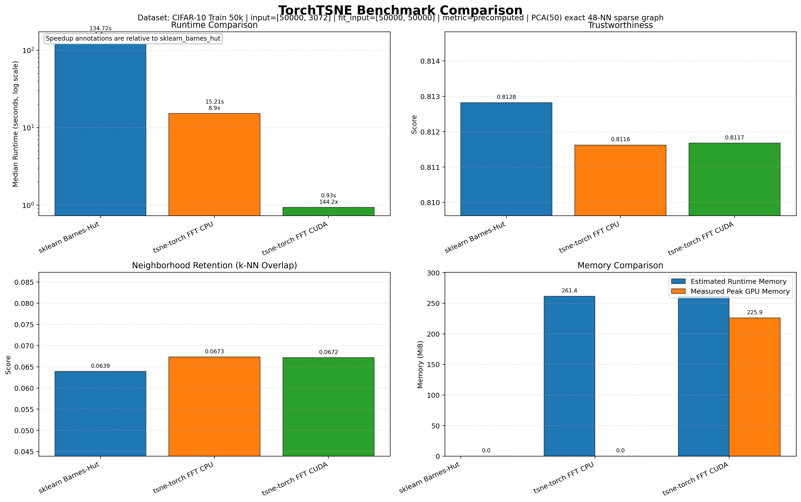
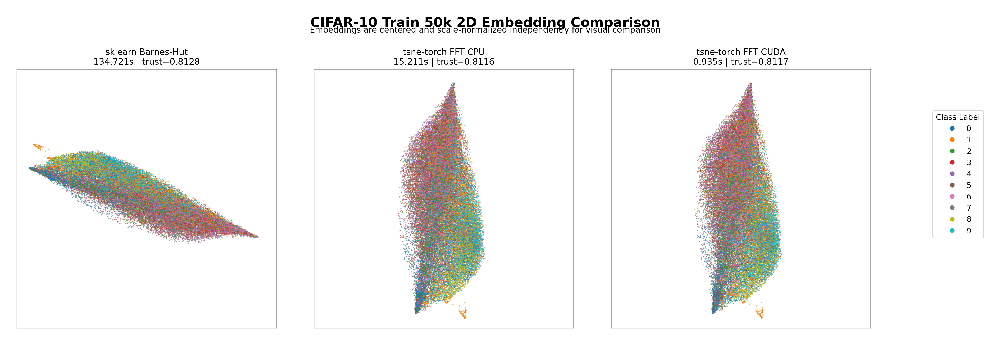
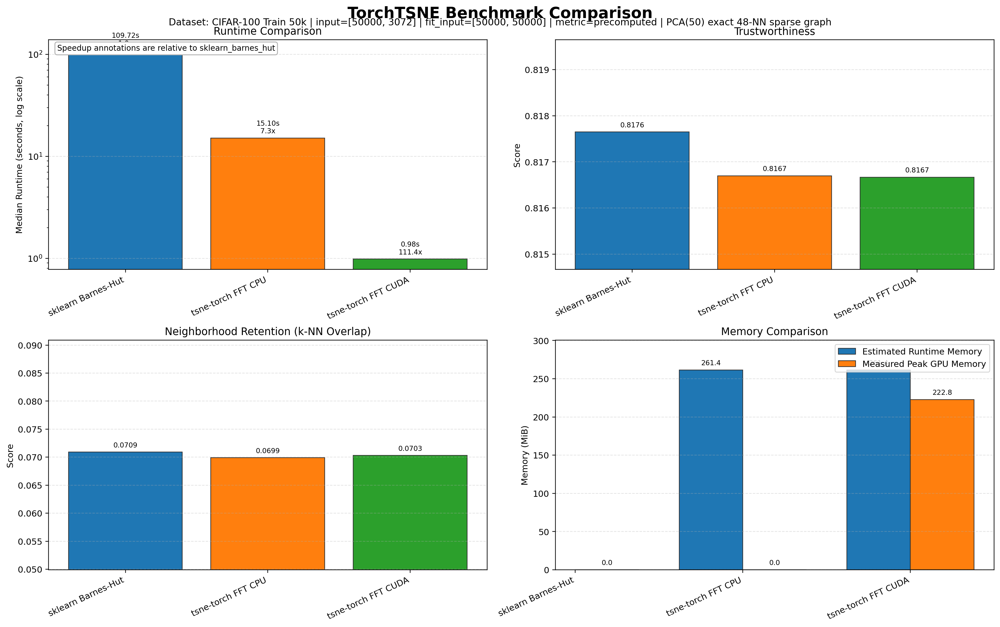
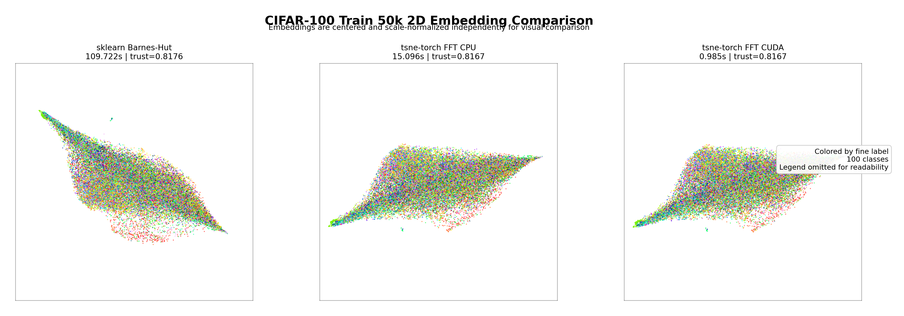

# Benchmark Report

This document holds the full benchmark story for `TorchTSNE`: validated environment, methodology, metric definitions, full tables, and links to every curated benchmark artifact in this folder.

The main [README](../../README.md) keeps only the high-signal landing-page highlights.

## Table Of Contents

- [Overview](#overview)
- [Test Environment](#test-environment)
- [Methodology](#methodology)
- [Metrics](#metrics)
- [Scaling Sweep](#scaling-sweep)
- [MNIST 60k](#mnist-60k)
- [CIFAR-10 50k](#cifar-10-50k)
- [CIFAR-100 50k](#cifar-100-50k)
- [Medium Dense](#medium-dense)
- [Large Sparse](#large-sparse)
- [Largest Shared Run](#largest-shared-run)
- [Artifact Index](#artifact-index)

## Overview

The benchmark suite is designed to answer three practical questions:

- Where does CUDA acceleration materially beat sklearn on comparable inputs?
- How does the FFT path scale relative to sklearn Barnes-Hut?
- What accuracy and memory tradeoffs appear as problem size grows?

The curated artifacts in this directory are single-run snapshots from the validated workstation below. They are useful engineering references, not universal constants.

## Test Environment

Validated workstation:

- CPU: `AMD Ryzen 7 9700X 8-Core Processor`
- CPU topology: `8 physical cores / 16 logical processors`
- GPU: `NVIDIA GeForce RTX 5070 Ti`
- System memory: `31.16 GiB RAM`
- Operating system: `Windows 11 Pro 25H2 (OS Build 26200.8037)`
- Python environment: `conda env1`
- Python version: `3.9.23`
- Numeric stack: `numpy 2.0.2`, `scikit-learn 1.6.1`, `torch 2.8.0+cu128`

These values matter because the large sparse FFT runs depend heavily on:

- available host RAM,
- free CUDA memory,
- CPU throughput during sparse graph preparation,
- GPU throughput during the FFT optimization loop.

## Methodology

Benchmark runner:

- reusable logic: [`src/tsne_torch/benchmarking.py`](../../src/tsne_torch/benchmarking.py)
- CLI wrapper: [`benchmarks/run_benchmarks.py`](../../benchmarks/run_benchmarks.py)
- console entry point: `tsne-torch-benchmark`

General methodology:

- CUDA is warmed up before timed runs.
- CUDA is synchronized around timed regions.
- Each run records end-to-end duration, backend timings, quality metrics, and memory diagnostics.
- Benchmarks emit both JSON results and PNG charts.
- For very large datasets, only the baselines that are still realistic to run are compared.

Important caveat:

- The scaling sweep artifact names still contain `1k_100k` for historical reasons, but the stored results now include the `250000` sample point as well.

## Metrics

### Runtime Metrics

- `median_duration`
  End-to-end runtime for a baseline.
- `timings["affinity_build"]`
  Time spent building dense or sparse affinities.
- `timings["optimization"]`
  Time spent inside the iterative optimization loop.
- `timings["knn_build"]`, `timings["perplexity_search"]`, `timings["symmetrize"]`, `timings["host_device_transfer"]`
  Finer affinity-build buckets used to separate neighbor search, perplexity calibration, sparse symmetrization, and CPU/GPU transfer overhead on the FFT path.
- `timings["stage1"]` and `timings["stage2"]`
  Early-exaggeration and post-exaggeration timing and stop-reason data.
- `stage1.objective_timings_median` and `stage2.objective_timings_median`
  Sampled median durations for attractive forces, negative-force sub-stages, error evaluation, and gradient finalization on the iterations where the loss is already computed.
- `median_iteration_time`
  Median steady-state iteration time inside a phase.

### Accuracy Metrics

- [`trustworthiness`](https://scikit-learn.org/stable/modules/generated/sklearn.manifold.trustworthiness.html)
  Local-neighborhood preservation score. Higher is better.
- `k-NN overlap`
  Direct nearest-neighbor-set retention score. Higher is better.
- `kl_divergence`
  The t-SNE objective value. Lower is better when numerically stable.

Large-scale caveat:

- On the largest sparse runs, `kl_divergence` can overflow. In those cases the most reliable signals are trustworthiness and k-NN overlap.

### Memory Metrics

- `peak_cuda_memory`
  Peak allocated CUDA memory observed during the run.
- `memory.required_bytes`
  Runtime memory estimate from the estimator preflight.
- `memory.fits`
  Whether the preflight estimate fit within the safe budget.

## Scaling Sweep

Artifacts:

- Figure: [`benchmark_scaling_sweep_1k_100k_scaling_sweep_sparse_graph_f512.png`](./benchmark_scaling_sweep_1k_100k_scaling_sweep_sparse_graph_f512.png)
- JSON: [`benchmark_scaling_sweep_1k_100k.json`](./benchmark_scaling_sweep_1k_100k.json)

Methodology:

- datasets: `blobs_1000_f512_sweep_graph`, `blobs_5000_f512_sweep_graph`, `blobs_10000_f512_sweep_graph`, `blobs_50000_f512_sweep_graph`, `blobs_75000_f512_sweep_graph`, `blobs_100000_f512_sweep_graph`, `blobs_250000_f512_sweep_graph`
- input shape: `512` features with a fixed-width `48`-neighbor sparse distance graph
- compared baselines: `sklearn_barnes_hut`, `tsne_torch_fft_cpu`, `tsne_torch_fft_cuda`
- benchmark mode: `--device cuda --repeats 1`

Results:

| Samples | Graph NNZ | sklearn Barnes-Hut (s) | tsne-torch FFT CPU (s) | tsne-torch FFT CUDA (s) | CPU Speedup vs sklearn | CUDA Speedup vs sklearn |
| ---: | ---: | ---: | ---: | ---: | ---: | ---: |
| `1000` | `48,000` | `0.847` | `4.697` | `0.838` | `0.18x` | `1.01x` |
| `5000` | `240,000` | `6.310` | `6.947` | `0.587` | `0.91x` | `10.76x` |
| `10000` | `480,000` | `20.172` | `10.445` | `0.883` | `1.93x` | `22.84x` |
| `50000` | `2,400,000` | `94.578` | `20.671` | `0.835` | `4.58x` | `113.21x` |
| `75000` | `3,600,000` | `131.769` | `26.015` | `0.975` | `5.06x` | `135.14x` |
| `100000` | `4,800,000` | `173.083` | `30.894` | `1.372` | `5.60x` | `126.15x` |
| `250000` | `12,000,000` | `589.699` | `71.356` | `2.410` | `8.26x` | `244.68x` |

Power-law fit analysis for the post-crossover regime (`n >= 5000`):

- `t_sklearn(n) ~= 6.572e-04 * n^1.095`
- `t_fft_cpu(n) ~= 6.064e-02 * n^0.551`
- `t_fft_cuda(n) ~= 5.040e-02 * n^0.287`
- `S_fft_cpu(n) ~= 1.084e-02 * n^0.544`
- `S_fft_cuda(n) ~= 1.304e-02 * n^0.809`

Headline observations:

- At `1000` samples the CUDA FFT path is effectively tied with sklearn Barnes-Hut, and by `5000` samples it is clearly ahead.
- The CUDA runtime slope is materially smaller than sklearn's, so the speedup continues to widen with sample count.
- `tsne_torch_fft_cuda` reaches `244.68x` measured speedup at `250000` samples.

## MNIST 60k

Artifacts:

- Runtime chart: [`benchmark_mnist_60k.png`](./benchmark_mnist_60k.png)
- Embedding chart: [`benchmark_mnist_60k_embeddings.png`](./benchmark_mnist_60k_embeddings.png)
- JSON: [`benchmark_mnist_60k.json`](./benchmark_mnist_60k.json)

Methodology:

- dataset: `torchvision.datasets.MNIST(train=True)` with `60,000` training samples
- preprocessing: flattened and normalized to `[0, 1]`, then reduced with `PCA(50)` only for one-time graph construction
- shared benchmark input: exact sparse `48`-NN squared-distance graph built once from the PCA-reduced features
- compared baselines: `sklearn_barnes_hut`, `tsne_torch_fft_cpu`, `tsne_torch_fft_cuda`
- benchmark mode: `--device cuda --repeats 1`

Results:

| Baseline | Median Runtime (s) | Trustworthiness | k-NN Overlap | KL Divergence | Peak GPU Memory |
| --- | ---: | ---: | ---: | ---: | ---: |
| `sklearn_barnes_hut` | `144.074` | `0.928501` | `0.244850` | `overflow` | `0 MB` |
| `tsne_torch_fft_cpu` | `21.099` | `0.931487` | `0.244850` | `102.975403` | `0 MB` |
| `tsne_torch_fft_cuda` | `1.287` | `0.931509` | `0.243250` | `102.976112` | `211.7 MB` |

Headline observations:

- `tsne_torch_fft_cuda` is `111.93x` faster than sklearn Barnes-Hut on the shared graph.
- `tsne_torch_fft_cpu` is `6.83x` faster than sklearn Barnes-Hut.
- Quality stays tightly clustered across the three runs.
- The scatterplots show visually consistent digit clusters across methods after independent embedding normalization for plotting.

## CIFAR-10 50k

Artifacts:

- Runtime chart: [`benchmark_cifar10_50k.png`](./benchmark_cifar10_50k.png)
- Embedding chart: [`benchmark_cifar10_50k_embeddings.png`](./benchmark_cifar10_50k_embeddings.png)
- JSON: [`benchmark_cifar10_50k.json`](./benchmark_cifar10_50k.json)

Methodology:

- dataset: `torchvision.datasets.CIFAR10(train=True)` with `50,000` training samples
- preprocessing: flattened RGB tensors normalized to `[0, 1]`, then reduced with `PCA(50)` only for one-time graph construction
- shared benchmark input: exact sparse `48`-NN squared-distance graph built once from the PCA-reduced features
- compared baselines: `sklearn_barnes_hut`, `tsne_torch_fft_cpu`, `tsne_torch_fft_cuda`
- benchmark mode: `--device cuda --repeats 1`

Results:

| Baseline | Median Runtime (s) | Trustworthiness | k-NN Overlap | KL Divergence | Peak GPU Memory |
| --- | ---: | ---: | ---: | ---: | ---: |
| `sklearn_barnes_hut` | `134.721` | `0.812823` | `0.063900` | `overflow` | `0 MB` |
| `tsne_torch_fft_cpu` | `15.211` | `0.811623` | `0.067300` | `114.248299` | `0 MB` |
| `tsne_torch_fft_cuda` | `0.935` | `0.811676` | `0.067150` | `114.248337` | `225.9 MB` |

Headline observations:

- `tsne_torch_fft_cuda` is `144.16x` faster than sklearn Barnes-Hut on the shared graph.
- `tsne_torch_fft_cpu` is `8.86x` faster than sklearn Barnes-Hut.
- Trustworthiness stays close across methods, while the `tsne-torch` FFT runs retain slightly higher k-NN overlap on this configuration.
- The embedding comparison preserves the coarse class families without requiring any custom CUDA extension build.

## CIFAR-100 50k

Artifacts:

- Runtime chart: [`benchmark_cifar100_50k.png`](./benchmark_cifar100_50k.png)
- Embedding chart: [`benchmark_cifar100_50k_embeddings.png`](./benchmark_cifar100_50k_embeddings.png)
- JSON: [`benchmark_cifar100_50k.json`](./benchmark_cifar100_50k.json)

Methodology:

- dataset: `torchvision.datasets.CIFAR100(train=True)` with `50,000` training samples
- preprocessing: flattened RGB tensors normalized to `[0, 1]`, then reduced with `PCA(50)` only for one-time graph construction
- shared benchmark input: exact sparse `48`-NN squared-distance graph built once from the PCA-reduced features
- compared baselines: `sklearn_barnes_hut`, `tsne_torch_fft_cpu`, `tsne_torch_fft_cuda`
- benchmark mode: `--device cuda --repeats 1`

Results:

| Baseline | Median Runtime (s) | Trustworthiness | k-NN Overlap | KL Divergence | Peak GPU Memory |
| --- | ---: | ---: | ---: | ---: | ---: |
| `sklearn_barnes_hut` | `109.722` | `0.817647` | `0.070900` | `overflow` | `0 MB` |
| `tsne_torch_fft_cpu` | `15.096` | `0.816699` | `0.069900` | `113.865616` | `0 MB` |
| `tsne_torch_fft_cuda` | `0.985` | `0.816667` | `0.070300` | `113.863251` | `222.8 MB` |

Headline observations:

- `tsne_torch_fft_cuda` is `111.40x` faster than sklearn Barnes-Hut on the shared graph.
- `tsne_torch_fft_cpu` is `7.27x` faster than sklearn Barnes-Hut.
- Quality stays tightly clustered, and the `tsne-torch` FFT runs remained numerically finite while sklearn still overflowed `kl_divergence`.
- The embedding figure omits the full legend intentionally because `100` fine labels are too dense to show cleanly in the margin.

## Medium Dense

Artifacts:

- Figure: [`benchmark_memory_smoke.png`](./benchmark_memory_smoke.png)
- JSON: [`benchmark_memory_smoke.json`](./benchmark_memory_smoke.json)

Dataset:

- `blobs_2048_f512`

Results:

| Baseline | Median Runtime (s) | Trustworthiness | k-NN Overlap | KL Divergence | Peak GPU Memory |
| --- | ---: | ---: | ---: | ---: | ---: |
| `sklearn_exact` | `26.741` | `0.991370` | `0.237050` | `0.986602` | `0 MB` |
| `sklearn_barnes_hut` | `2.039` | `0.991340` | `0.235650` | `0.985958` | `0 MB` |
| `tsne_torch_exact_cpu` | `5.332` | `0.991196` | `0.232150` | `0.986734` | `0 MB` |
| `tsne_torch_exact_cuda` | `0.250` | `0.991256` | `0.233350` | `0.987457` | `160.2 MB` |
| `tsne_torch_fft_cuda` | `0.715` | `0.991202` | `0.232400` | `0.981277` | `37.6 MB` |

Headline observations:

- `tsne_torch_exact_cuda` is about `106.8x` faster than sklearn exact.
- `tsne_torch_fft_cuda` is about `37.4x` faster than sklearn exact.
- Quality remains close across methods on trustworthiness and neighborhood retention.

## Large Sparse

Artifacts:

- Figure: [`benchmark_100k_cuda.png`](./benchmark_100k_cuda.png)
- JSON: [`benchmark_100k_cuda.json`](./benchmark_100k_cuda.json)

Dataset:

- `blobs_100000_f512_graph`

Results:

| Baseline | Median Runtime (s) | Trustworthiness | k-NN Overlap | KL Divergence | Peak GPU Memory |
| --- | ---: | ---: | ---: | ---: | ---: |
| `sklearn_barnes_hut` | `162.981` | `0.996057` | `0.313150` | `overflow` | `0 MB` |
| `tsne_torch_fft_cpu` | `29.413` | `0.996094` | `0.315350` | `90.401367` | `0 MB` |
| `tsne_torch_fft_cuda` | `1.638` | `0.996086` | `0.320200` | `90.390915` | `479.3 MB` |

Headline observations:

- `tsne_torch_fft_cuda` is about `99.5x` faster than sklearn Barnes-Hut.
- `tsne_torch_fft_cpu` is about `5.5x` faster than sklearn Barnes-Hut.
- sklearn still overflows `kl_divergence` here, while the `tsne-torch` FFT runs remained finite on this configuration.

## Largest Shared Run

Artifacts:

- Figure: [`benchmark_1m_shared.png`](./benchmark_1m_shared.png)
- JSON: [`benchmark_1m_shared.json`](./benchmark_1m_shared.json)

Dataset:

- `blobs_1000000_f512_graph_shared`

Results:

| Baseline | Median Runtime (s) | Trustworthiness | k-NN Overlap | KL Divergence | Peak GPU Memory |
| --- | ---: | ---: | ---: | ---: | ---: |
| `sklearn_barnes_hut` | `3797.394` | `0.999542` | `0.684350` | `overflow` | `0 MB` |
| `tsne_torch_fft_cpu` | `298.184` | `0.999545` | `0.684100` | `115.955078` | `0 MB` |
| `tsne_torch_fft_cuda` | `9.732` | `0.999544` | `0.682400` | `115.956100` | `4795.4 MB` |

Headline observations:

- `1000000` samples is the largest size validated here for both sklearn and TorchTSNE.
- `tsne_torch_fft_cuda` is about `390.2x` faster than sklearn Barnes-Hut.
- The shared million-sample run is feasible on this workstation only because the benchmark uses a sparse precomputed graph rather than a dense feature matrix.

## Artifact Index

| Artifact | Purpose |
| --- | --- |
| [`benchmark_scaling_sweep_1k_100k_scaling_sweep_sparse_graph_f512.png`](./benchmark_scaling_sweep_1k_100k_scaling_sweep_sparse_graph_f512.png) | Scaling sweep figure through `250000` samples |
| [`benchmark_scaling_sweep_1k_100k.json`](./benchmark_scaling_sweep_1k_100k.json) | Scaling sweep raw results and fit analysis |
| [`benchmark_mnist_60k.png`](./benchmark_mnist_60k.png) | `MNIST 60k` runtime / quality / memory comparison |
| [`benchmark_mnist_60k_embeddings.png`](./benchmark_mnist_60k_embeddings.png) | `MNIST 60k` side-by-side 2D embedding scatterplots |
| [`benchmark_mnist_60k.json`](./benchmark_mnist_60k.json) | `MNIST 60k` raw results |
| [`benchmark_cifar10_50k.png`](./benchmark_cifar10_50k.png) | `CIFAR-10 50k` runtime / quality / memory comparison |
| [`benchmark_cifar10_50k_embeddings.png`](./benchmark_cifar10_50k_embeddings.png) | `CIFAR-10 50k` side-by-side 2D embedding scatterplots |
| [`benchmark_cifar10_50k.json`](./benchmark_cifar10_50k.json) | `CIFAR-10 50k` raw results |
| [`benchmark_cifar100_50k.png`](./benchmark_cifar100_50k.png) | `CIFAR-100 50k` runtime / quality / memory comparison |
| [`benchmark_cifar100_50k_embeddings.png`](./benchmark_cifar100_50k_embeddings.png) | `CIFAR-100 50k` side-by-side 2D embedding scatterplots |
| [`benchmark_cifar100_50k.json`](./benchmark_cifar100_50k.json) | `CIFAR-100 50k` raw results |
| [`benchmark_memory_smoke.png`](./benchmark_memory_smoke.png) | Medium dense comparison figure |
| [`benchmark_memory_smoke.json`](./benchmark_memory_smoke.json) | Medium dense raw results |
| [`benchmark_100k_cuda.png`](./benchmark_100k_cuda.png) | `100000 x 512` sparse benchmark figure |
| [`benchmark_100k_cuda.json`](./benchmark_100k_cuda.json) | `100000 x 512` sparse raw results |
| [`benchmark_1m_shared.png`](./benchmark_1m_shared.png) | Largest shared sklearn/tsne-torch comparison figure |
| [`benchmark_1m_shared.json`](./benchmark_1m_shared.json) | Largest shared raw results |
